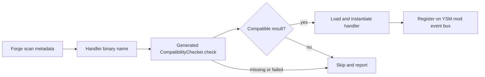

<!-- Modified by LuoMuQAQ for the unofficial Minecraft 26.3 / NeoForge port (2026). -->
# 游戏与扩展接入

> **适用问题**：NeoForge 生命周期接入、entity attachments、渲染 hook、兼容适配与扩展装载；**不包含**：第三方模组内部机制、通用公共 API 承诺和游戏业务规则的重新定义。

接入层把 Minecraft/NeoForge 的实体、事件与绘制上下文交给 YSM 已有 owner。Common、client-only、per-entity 并行求值与 render-thread hook 是不同边界；新增接入点时不能只凭它们都使用 event bus 就假定相同调用线程或状态权限。

## 游戏侧接入

| 窗口 | 定位符号 | 交接对象 |
|---|---|---|
| Common / client setup | `event.CommonEvent`、`client.event.ClientSetupEvent` | 基础设施、网络注册、client 兼容适配和服务；顺序见[运行模型](../runtime-model.md) |
| Entity attachments | `event.CapabilityEvent`、`ModelInfoCapability`、各类 `AnimatableCapability` | 将模型选择/同步事实与客户端动画对象关联到 entity；服务端不运行客户端骨骼求值 |
| 登录与退出 | `ClientLoggedEvent`、`ServerStartingEvent` | 将 exact connection 或 server lifecycle 交给对应 session/service owner |
| 客户端输入与命令 | `client.input`、`client.command`、`command` | 产生选择、动画或管理意图，继续经过所属领域入口 |
| Entity 替换绘制 | `GeoReplacedEntityRenderer`、`client.renderer` | 在 submit 时消费有效 `ModelState`，生成顶点快照并交给 `SubmitNodeCollector` |
| Renderer 与装备资源重载 | `EntityRenderersEvent.AddLayers` | 从宿主当前 `EntityRendererProvider.Context` 建立替换 renderer，取得已加载的模型集与 `EquipmentLayerRenderer`，资源重载时同步重建 |
| 可选模组适配 | `client.compat` 与 controller collection | 把外部动作、装备、视角和材质条件投影为当前输入或绘制行为 |

模型选择、授权、收藏及服务端投射物/载具状态由正式注册的 NeoForge `AttachmentType` 持有。持久字段通过 `ValueInput` / `ValueOutput` 与 `CompoundTag.CODEC` 写入；复制时由 NeoForge 的 attachment clone 生命周期统一处理，玩家选择通过专用 copy handler 转移 roaming、properties tracker 与尚未恢复的保存选择，授权和收藏独立复制。目录缺件时的运行兜底不覆盖存档选择，恢复窗口与权限见[玩家状态与控制](../network/player-state.md#存档选择与运行兜底)。数据不使用 NeoForge 自动同步，权威同步仍走 YSM typed messages。

客户端动画使用单独的 transient attachment。Common registry 只引用不含 Minecraft client 类的 holder，实际玩家动画 owner 在客户端按实体建立；投射物/载具动画只在收到对应模型状态后创建。实体离开世界时仅释放已经存在的动画 owner，再移除 transient slot，不为 cleanup 创建新的动画对象。客户端玩家 Clone 将原实体已存在的 owner 状态转移到新实体。

旧 NeoForge 玩家 `yes_steve_model:model_id/own_models/star_models` 数据由离线世界副本工具 `scripts/prepare-world-copy.py`置入持久 `ysm:legacy_player_data`，保留完整原记录、来源路径及 SHA-256。服务端 tick 在模型 session 已发布后、每个新 Catalog snapshot 上尝试应用：仅在源文件内容吻合且 Catalog 已接纳时取得当前模型身份，原授权和收藏按各自列表迁移；缺失或失败来源继续保存待迁移记录。模型选择保留纹理、mandatory、disabled 和 Molang storage，通过现行 session 的普通权限恢复并发布 authority delta，不产生 ignore-grants 权限。每项成功只应用一次；显式选模或模型命令终止待恢复的旧选择。此桥覆盖已准备的玩家记录；ForgeCaps 结构和实际升级后的保存仍需独立验证。

旧 NeoForge 投射物和载具的 `owner_model_id` 与服务端 Molang 参数也由副本工具迁移。空的未初始化 default 槽直接包装为当前附件；有实际归属的记录保存在 `ysm:legacy_entity_data`，仅在相同来源通过校验和 Catalog 准入后应用。服务端实体加入世界时以及目录发布后对已加载实体尝试，未加载实体以后加入时处理；成功通过现行 entity 状态消息通知观察者。每项只恢复一次，新权威 owner 或骑乘赋模取消该槽的待恢复旧记录。

副本工具要求 `nbtlib==2.0.4`，输入为旧世界、空的目标目录和模型来源映射 JSON；运行 `python scripts/prepare-world-copy.py --help` 查看参数。映射把旧路径绑定到新实例 custom/auth 中的相对路径和原文件 SHA-256；仅已有完整导入证据的来源可附 `verified_model_hash` 以处理重复身份路径。`old_roaming_key` 由旧模型实际身份前四字节确定，不能从文件名猜测。工具拒绝覆盖已有世界，核对逐文件复制哈希及未改变的玩家字段，保留修改前玩家 NBT 和实体 region，核对其他模组附件及全部非 YSM 实体字段，重读 region 校验所有 chunk 内容和原时间戳；不改 terrain/POI 或 DataVersion，不替游戏执行世界升级。

实体替换、通用层和模型预览的提交路径已经接到宿主 submit；SDL3 热键、核心界面和 HUD 已适配宿主输入与状态提取入口。第一人称手臂在宿主空主手及地图绘制窗口替换，普通非空持物与空副手均不额外补交手臂；单侧可见性与既有资产的屏幕坐标偏移见[逐帧状态与调度](../rendering/frame-execution.md)。有真实目标依赖的联动已适配该依赖；其余旧联动通过反射桥保留逻辑并按能力降级。源码接线不等于实机支持，见[当前支持状态](../../status/support-and-verification.md)。

必需 Mixin 中，箭入地状态由额外信息接口的 `ysm$isInGround()` 委托宿主 protected `AbstractArrow.isInGround()`，避免接口公开方法与宿主同名，也不再 shadow 已删除字段；帧 profiler 注入目标为 `GameRenderer.render()V`。骑乘使用三参数 `startRiding`，箭的额外药水效果从 `PotionContents.customEffects()` 取得。全部已登记必需 Mixin 的目标、descriptor、静态属性、注入点和使用的局部变量已按宿主字节码检查；运行时变换与其他模组组合仍需实机验证。

模型替换的业务范围与可选联动降级由[联动决策](../../product-decisions/decisions/mod-integration.md)和[联动风险](../../product-decisions/decisions/integration-risk.md)定义。现有兼容分支不是统一输入层；其未收敛的部分见[动画问题](../../status/known-issues/animation.md)。

## 可选联动边界

`ClientSetupEvent` 逐项隔离可选初始化，失败只禁用对应联动并记录诊断。`OptionalApi` 通过真实 provider 类型和成员调用未固定目标依赖的旧联动，缓存解析结果；找不到成员、签名歧义、运行异常或链接失败时禁用该联动并返回局部缺省值。反射桥不提供外部 API 的替身，也不证明 provider 的业务语义或线程要求已符合目标宿主。Fatal VM error 不作为普通兼容失败处理。必要清理在联动禁用后仍执行。

Touhou Little Maid 使用单独的客户端 transient attachment，common 注册只持有通用 holder，与载具动画 slot 独立。接管前核对真实 renderer 的 `SubmitNodeCollector` 边界、实体接口与事件类型；注册失败撤回 factory 和已经注册的监听器。旧即时缓冲 provider 保留原渲染，YSM 不接管。Provider 缺失或未能验证时该联动不宣称支持；禁用状态不阻止释放已有动画 owner。第三方绘制和模型/贴图界面保留接线，未完成的 roaming 与 geo-model 适配仍见[动画问题](../../status/known-issues/animation.md)。

## 已有事件表面

`api.model.v0` 与 `api.rendering.v0` 中的 YSM 事件使用 mod event bus。`RegisterModelLocatorEvent` 把特定 `ModelKind` 的 locator 注册函数交给订阅方，注册窗口由对应 locator owner 建立；它不把整份骨骼模型的修改权交给扩展。

在 `GeoReplacedEntityRenderer` 的玩家主路径，`RenderModelEvent` 位于有效 `ModelState` 的模型提交前；取消只跳过该处默认模型 render，包括由同一快照提交的主模型轮廓。事件携带宿主提取的 `outlineColor`，零值表示不提交轮廓。`RenderLayerEvent` 包围默认 layer 遍历，取消只影响该 layer。两者携带本次 draw 的 `PoseStack`、`SubmitNodeCollector` 和 `GeoRenderData`，不供延迟顶点回调长期持有。取消其中一个不能回滚已完成的动画或资源取得，也不能取消阴影、火焰或其他不相关宿主绘制。玩家替换取消 `RenderPlayerEvent.Pre` 后，原版模型、层和名字牌不会由 `AvatarRenderer` 提交；名字牌由替换渲染器按提取状态另行提交。

宿主 `RegisterRenderStateModifiersEvent` 把实体 id 写入渲染状态，提交时再按 id 解析实体。这不是 `RegisterRenderStateModifierEvent` / `RenderStateModifier.apply()` 的公共扩展入口；后者仍只有声明，生产路径没有发布该注册事件，见[渲染问题](../../status/known-issues/rendering.md#扩展接线)。规划中的公共适配能力仍由[联动方向](../../future/mod-animation-integration.md)承载；已有声明不构成稳定公共 API 承诺。

## 扩展兼容检查与注册

`@YsmExtension` 为类或方法声明兼容检查入口，`@YsmEventHandler` 为可自动发现的 handler 声明同类检查要求。`YsmExtensionProcessor` 在编译期间分析扩展所拥有的类及依赖，并生成 checker；运行时 `YsmEventHandlerLoader` 在 `FMLLoadCompleteEvent` 从 Forge scan metadata 发现 handler 名称，去重排序后逐个处理。

`YsmEventHandlerRegistration.prepare()` 先加载并执行 checker，兼容结果成立后才实例化 handler。缺失 checker、检查失败、类加载或注册异常按 handler 隔离；有 warnings 的兼容结果可以注册并记录诊断。该检查处理链接与声明覆盖，不验证第三方业务语义、并发正确性或游戏视觉效果。

Forge scan data 的产生与 FML 内部装载属于外部 loader 边界。YSM 这里只定义拿到 metadata 后的处理；不能据此推断其他模组 handler 的完整初始化顺序。扩展最终仍要满足所接入 owner 的线程、生命周期和取消边界。
