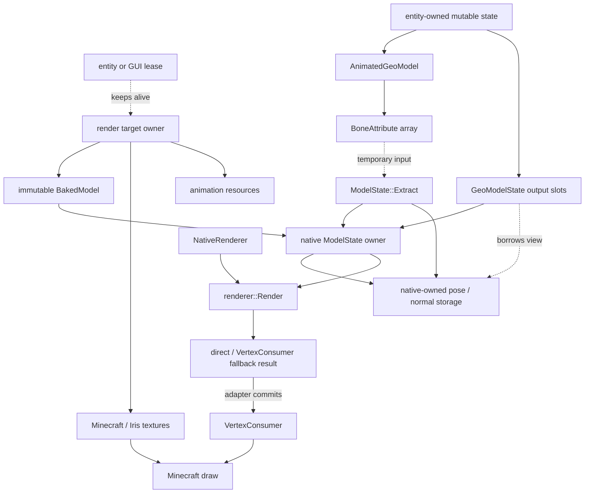

<!-- Modified by LuoMuQAQ for the unofficial Minecraft 26.3 / NeoForge port (2026). -->
# 渲染架构

> **适用问题**：几何烘焙、骨骼状态提取、CPU 调度、顶点布局与 Minecraft 提交；**不包含**：动画脚本语义、模型授权和未来 GPU renderer。

本主题描述当前 CPU renderer 的逻辑结构。顶层目标见[渲染系统](../../concepts/rendering.md)；公开模型数据以 [Model Schema](../../standards/model-schema/README.md) 为准。这里的 YSM native `BakedModel`、`ModelState`、`RenderSchedule`、`RenderTask` 和 `VertexKind` 都是内部实现契约，不反向定义模型格式。

## 责任边界

| 参与方 | 当前所有权与职责 | 不拥有 |
|---|---|---|
| Java 模型与渲染接入 | render target、`ResourceLease`、`GeoModelState`、纹理、`entity` / `level`、`PoseStack` 和 `RenderContext`；选择 `RenderType`，取得 `VertexConsumer`，发起 bake / extract / render | native 热数据布局、顶点计算、GPU draw |
| native renderer | `BakedModel`、`ModelState`、`RenderSchedule` / `RenderTask`；静态烘焙、骨骼层级、逐帧状态提取、CPU 调度、变换、面剔除、透明排序和顶点生成 | catalog、纹理对象、Minecraft render state、GPU resource |
| Minecraft / Iris | `RenderType`、`SubmitNodeCollector`、`VertexConsumer`、纹理注册、批处理、上传和 draw | 模型来源、`BakedModel`、动画状态 |

Target 由[ResourceLease](../model-management/ownership-and-lifecycle.md)保活；[Processor](../animation/processor-and-bone-output.md)写骨骼属性，[帧执行](frame-execution.md)拥有输出槽、借用与失效规则。

## 三阶段契约

| 阶段 | 频率与执行位置 | 输入 | 输出 |
|---|---|---|---|
| bake | 模型或影响烘焙的资源变化时；后台构建路径 | 几何、基础纹理 alpha、UV 约定和 `BakeModelOptions` | 不可变 `BakedModel`；可选 serialized baked cache |
| extract | 每个需要新动画结果的 `entity` 与 `RenderContext`；`level` entity 主路径可在 Java worker，部分同步路径仍在渲染线程 | `BakedModel` 与 `BoneAttribute` | 有效 `ModelState`、Java 借用 pose / render-bone view、locator indices 和 `RenderSchedule` |
| render | Minecraft 渲染线程在 submit 时发起；调用线程参与 native 执行 | 当时有效的 `ModelState`、该 pass 的投影与 model-view、`RenderParameters` | 成功后得到 Java 拥有的不可变顶点快照；稍后的 `submitCustomGeometry` 回调只把快照写入 `VertexConsumer` |

阶段名描述数据依赖，不保证固定线程。Native 渲染 worker 不执行动画求值或 extract；具体线程与同步边界见[逐帧状态与调度](frame-execution.md)。

世界实体和 GUI 预览都不在 extract 时生成依赖投影的顶点。submit 当时 `ModelState` 仍然有效，并且该 pass 的投影与 model-view 属于这次上下文：生产路径强制使用已有 fallback `nRender`，立刻复制共享顶点数组。`SubmitNodeCollector.submitCustomGeometry` 的回调只回放这份不可变快照，不重新读取 native 状态、不重算动画、不重放声音，也不读取另一 pass 的投影。宿主通常在同一帧 `prepareFrame` 中同步调用回调；如果该帧没有准备帧，快照会留到下一次准备。因此回调不能捕获 `Entity`、可复用 `GeoRenderData`、native view 或全局 scratch。`ResourceLease` 保活模型 target，不冻结可变 `ModelState`。没有投影副本时本次提交直接跳过，不用单位矩阵冒充缺失投影。

## 子主题

- [渲染决策理由](design-rationale.md)：native 能力边界、派生 cache 身份与共享 residency 取舍。
- [Bake、分区与 cache](bake-and-partition.md)：`BakedModel`、切线烘焙、四逻辑分区和 AoSoA。
- [逐帧状态与调度](frame-execution.md)：extract、可见性、附着点、任务拆分与低延迟同步。
- [CPU render 与顶点输出](vertex-output.md)：矩阵、剔除、normal / tangent、`RenderType`、`VertexConsumer`、输出区间、透明排序和 SIMD。
- [GPU Compute Renderer](../../future/gpu-compute-renderer.md)：尚未实现的 GPU 资源与调度方向。
- [渲染已知问题](../../status/known-issues/rendering.md)：当前可证实的视觉、失败处理、验证和重入缺口。

## 跨语言定位

| 要检查的边界 | Java 入口 | Native 入口 |
|---|---|---|
| 资源到静态几何 | `natives.render.NativeBakedModel` | `ysm::gfx::bake::BakeModel`、`BakedModel` |
| 骨骼数组到帧状态 | `GeoModelState`、`natives.render.NativeModelState` | `ModelState::Extract`、`RenderSchedule` |
| Draw 到输出区间 | `NativeRenderer.capture()`、`DeferredModelDraw`、`FallbackVertexWriter.writeOwned()` | `ysm::gfx::renderer::Render`；当前提交使用 fallback 顶点，不改变 native ABI |

Java 包名前缀为 `com.elfmcys.ysm`。跨 JNI 保活见[JNI 与内存](../native-runtime/jni-and-memory.md)，可取消绘制窗口见[游戏与扩展接入](../integration/README.md)。
