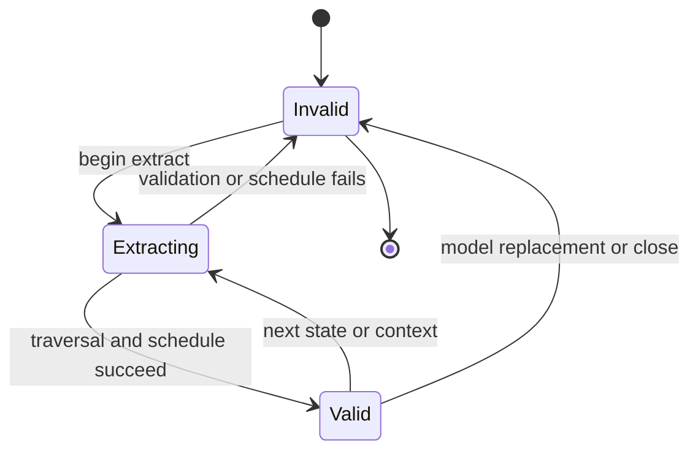
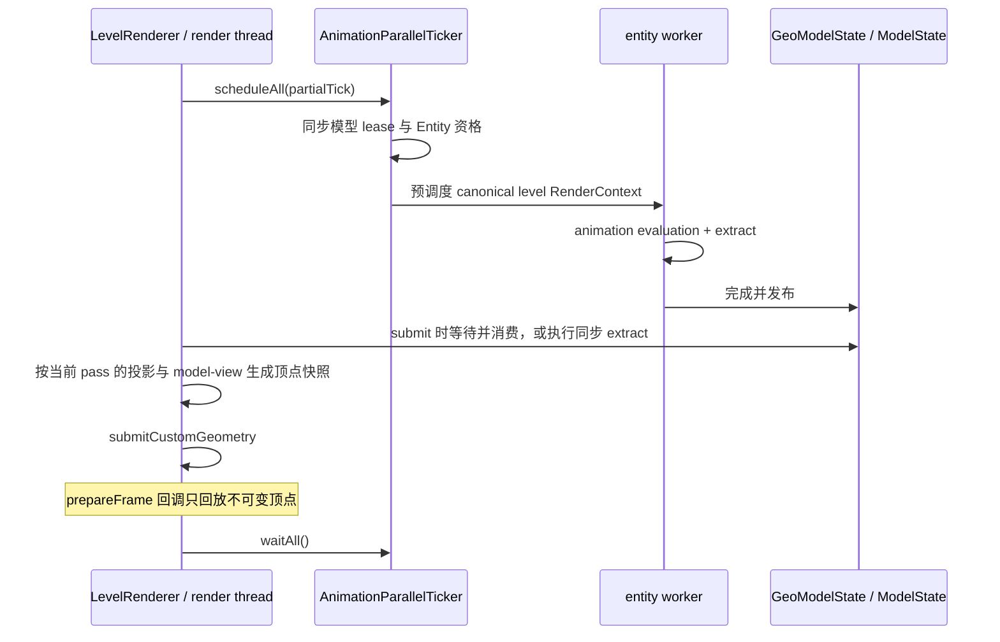
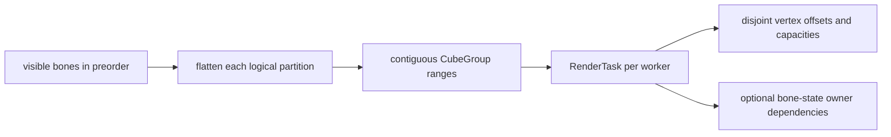

<!-- Modified by LuoMuQAQ for the unofficial Minecraft 26.3 / NeoForge port (2026). -->
# 逐帧状态与调度

`GeoModelState.extract(...)` 调用 `ModelState::Extract`，把 Java [`AnimationProcessor`](../animation/processor-and-bone-output.md) 已求值的 `BoneAttribute` 转成可供一次或多次 draw 消费的逐帧状态，并在可见工作集变化时生成 `RenderSchedule`。`GeoModelState` 拥有这份结果；Extract 不生成顶点，也不运行 render worker。

## 输入、输出与状态

| 对象 | 内容与所有权 |
|---|---|
| `BoneAttribute` | `AnimatedGeoModel` 的实体级求值结果；Extract 期间只临时读取，通道语义见[骨骼输出](../animation/processor-and-bone-output.md) |
| pose / normal buffer | Native `ModelState` 拥有 `BonePose` 容器；Extract 原位写入，Java 通过 `BonePoseView` 借用 |
| frame state | `GeoModelState` 拥有 native `ModelState`；后者共享 `BakedModel`，并拥有 pose、可见骨骼索引、locator scratch、`RenderSchedule` 与有效标记 |
| locator result | Native 临时暂存并复制 active locator 骨骼索引；Java 保存 locator 到骨骼索引的映射，访问时读取同一状态的借用 pose view |
| `RenderSchedule` | 当前可见骨骼和 worker 数对应的只读计划；由 `RenderTask` 描述工作与输出范围 |

`GeoModelState.extract(...)` 开始先使旧状态失效；只有 `BoneAttribute`、容量、`ModelState::Extract` 层级遍历和调度全部成功后才整体发布为有效。失败不能继续消费上一帧结果。成功的 `ModelState` 共享持有 `BakedModel`，并拥有 pose 与 render-bone 索引存储；它不保留 `BoneAttribute`。`NativeModelState` 只把返回地址包装成 Java 借用 view，不转移 allocation 所有权。View 必须在下次 Extract 或 close 前消费完毕，不能因 Java view 仍可达就继续使用旧地址。后续 Extract 可覆盖或扩容 native 存储；任何覆盖、换模或释放都必须发生在此前 Extract、Render 与 locator 消费完成之后。

## 层级遍历与可见性

骨骼按 `BakedModel` 的稳定 preorder 单次遍历，用可复用 pose stack 组合 parent pose、pivot、位移、ZYX rotation、scale 与反 pivot。Pivot 与 `BoneAttribute.position` 在此按模型单位转换；baked cube position 不由 Extract 统一缩放。Position 与 normal pose 分开维护；非有限属性、零 scale 或非有限结果会跳过整棵 subtree。

颜色、透明度和 glow 直接从当前 bone 的 packed attribute 复制到对应 `BonePose`，不进入 pose stack，也不从 parent 继承。非法 packed 整数或 glow 字节使 Extract 失败。

- 隐藏当前骨骼几何只影响该骨骼及其附着点；child 继续遍历。
- 隐藏子级会保留当前骨骼自身，再利用 subtree range 跳过全部后代。
- 只有未隐藏且实际拥有几何的骨骼进入 render bone 序列；正常生产路径由 preorder 构造，因此稳定且唯一。
- 附着点供 Java 原版 layer 使用；`locator_sequence` 只标记需要回传的 active bone。`ModelState::Extract` 返回对应 bone indices，`GeoModelState` 据此建立 locator 到骨骼索引的映射，访问时通过当前 `BonePoseView` 读取 native pose，不长期复制 pose records。

Locator sequence 从 1 开始，Java 映射槽从 0 开始。提取、组大小查询和遍历统一使用 `sequence - 1`，组大小只计算该定位点的 active bones，不能读取相邻组。持物层据此决定是否提交物品，第三人称和左上角预览共用此规则；缺少背包等其他定位点不会抑制手部持物。模型通过隐藏或零缩放明确关闭的定位点仍不进入 active group，不添加默认位置补画。

## Java 预调度与 context

世界 `LevelExtractor.extract` 早于本帧投影上传。依赖投影的 native culling 与顶点生成发生在实体 submit：此时本帧 level 投影已经绑定，model-view 来自相机。CPU 矩阵按当前绑定的 UBO slice 查询，缓存命中也不沿用其他 pass 的矩阵；深度方向适配见[顶点输出](vertex-output.md)。GUI picture-in-picture 的 `renderToTexture` 才是预览 submit 时刻。预览状态保存实际视口和原屏幕绘制锚点，renderer 将锚点换算到纹理内；预览不以脚底为中心建立固定的小纹理。预览状态可以持有本帧的 animatable 或玩家直到这次绘制；延迟顶点回调仍然只回放快照，不读预览实体。

原版背包 `InventoryScreen` 提取的状态携带 YSM inventory 标记。之后 `GuiEntityRenderer` 调用 dispatcher submit 时，`YsmSubmitContext` 将相机、inventory 范围和该状态的方向快照绑定到当前线程；结束或异常时恢复外层范围。此时动画明确使用非 level、mutable GUI context，且使用宿主鼠标控制的 body/head 方向。标记随状态跨过提取/提交边界，动画 worker 不读取另一线程的 GUI 范围。

左上角玩家预览的矩阵按最短角度插值后的身体 yaw 抵消世界朝向，再保留配置的屏幕 yaw 偏移，默认 5°；跨 ±180° 使用与实体动画相同的 `rotLerp`，避免观察矩阵突转。该偏移只施加到预览矩阵，玩家身体、头部 yaw 和 pitch 保留真实值供动画读取；不能把偏移也写入玩家朝向，否则渲染器的 `180 - bodyRot` 会把它抵消。HUD 与预览设置页面共用这条路径。

玩家 HUD、模型与贴图预览在同步 submit 内通过宿主 `extractEntity` 取得新的 `AvatarRenderState`，随后把该状态交给替换 renderer 的装备层；非玩家预览仍无 avatar 状态。状态提取发生在预览姿态和装备显示选项应用之后，鞘翅及肩部鹦鹉不依赖空缺的 GUI 状态，也不借用世界其他 pass 的可变状态。GUI 预览玩家在宿主提取前刷新当前 client level，没有世界时跳过提交，避免保留上一世界或空世界引用。纯矩阵的死亡、旋转攻击与睡眠姿态处理读取实体事实，不临时清除死亡 tick 或旋转攻击标志。

GUI 虚拟玩家在构造时分配独立的负数实体 ID，供宿主状态提取及物品渲染使用。Client level 的初始 ID 为零，真实玩家随后由网络分配 ID；预览玩家不接收 spawn packet，也不加入世界实体表，因此不能依赖该分配流程。ID 在预览玩家生命周期内保持稳定，刷新 level 或重用预览资源不重新分配。

鞘翅保留模型 locator 的位置、旋转与 authored scale，按所选物品 `Equippable.assetId` 交给宿主 `EquipmentLayerRenderer` 的 `WINGS` 层。Locator 遍历已组合当前骨骼 pose 与 pivot，宿主翼片的肩部根节点位于局部 y=0，层仅用 Z 轴 180° 旋转转换坐标方向，不额外平移高度；宿主几何使用标准方块单位，不追加固定两倍放大。默认纹理由装备资源定义选择，玩家鞘翅/披风仅作为宿主允许的 override。装备资源、资源包、箔片、着色和提交次序由宿主处理，YSM 不使用旧实体纹理路径或复制装备资源。层与 baked model 跟随 `AddLayers` 的宿主资源代次重建。

第一人称手臂仅在宿主实际绘制手臂的 `RenderArmEvent` 窗口替换，覆盖空主手及单手/双手地图。普通非空持物继续由宿主提交物品，不额外插入空手姿态手臂；空副手也不额外绘制。物品的装备、挥动和使用变换属于宿主。`DeferredModelDraw.submit` 返回是否捕获有效顶点并实际加入 collector；原有手臂只有在该结果为 true 时被取消，捕获失败保留原有绘制。

Geometry 装配按用途显式传递 locator type：玩家身体使用 PlayerLocator，第一人称 arm 使用 FirstPersonLocator，投射物和载具使用各自类型。驻留默认模型、新 bake 和既有 baked cache 重开都使用同一用途选择；locator map 在 Java GeoModel 重建，不序列化进 native baked payload，因此修正绑定不要求删除几何缓存。

第一人称 owner 先经过普通动画更新，核对 GeoModel 的 locator type，再针对请求侧重新 Extract：临时隐藏另一侧 arm locator 和 Background 的整棵子树，完成后恢复两个 authored hidden 通道。单侧可见性不写回 controller，也不额外推进动画或发送声音；即使普通更新复用了同帧输出，也不能复用上一只手的可见性。类型不符时记录限频诊断并不接管，请求侧缺少 locator 时也不接管。第一人称资产按 YSM 原有屏幕坐标编写：宿主提供空手/地图的外层变换，YSM 在左侧平移 `(0.25, 1.8, 0)`、右侧平移 `(-0.25, 1.8, 0)`，再缩放 `(-1, -1, 1)`。不再将自定义肩部锚定到宿主玩家模型的 initial pose，也不追加宿主原版手臂部件的 Z 旋转；该对齐会改变既有资产的画面位置。顶点在下一侧 Extract 前已被复制，延迟回调不会读到换侧后的状态。

模型目录卡片的实体预览、预览图和前景图，以及分类文件夹卡片的封面都裁剪到标题上方，图片保留原始绘制锚点和尺寸。标题底色及名称在状态装饰之后的新 stratum 提取，文字使用显式不透明 ARGB，授权遮罩与延迟 picture-in-picture 不覆盖标题。模型名称仍使用目录元数据的语言翻译及文件名回退，分类名称使用模型包语言翻译与目录名回退。

动作轮盘先提交扇区背景，再在新 stratum 提取路径、动作名称、快捷键和配置图标。直接交给 GuiGraphicsExtractor 的文字色使用显式 ARGB；样式自身的 RGB 颜色不代替基础色的 alpha，透明度为零的基础色不会建立文字状态。

每次 draw 刷新矩阵、光照、相机和 context metadata，不随 pose 复用。Java `RenderContext` 表示会影响动画、姿态或 pass 的调用环境，并决定状态是否可复用；“可复用”与“是否在 worker 执行”是两个维度：

| 路径 | 状态语义 | Extract 位置 |
|---|---|---|
| `level` entity 且满足预调度资格 | canonical `immutable`；同一逻辑帧可供多个兼容 pass 复用 | Java worker，render 时按需等待 |
| `level` entity 但未预调度 | 同样可以是 `immutable` | 渲染线程同步执行 |
| `inventory`、`paperDoll` 或 `firstPersonMod` | mutable；每次重新求值，不覆盖 canonical 槽 | 渲染线程同步执行 |
| 本地第一人称 `irisShadow` | 强制 mutable，避免复用第三人称状态 | 渲染线程同步执行 |
| GUI preview `Entity` | `immutable` 只表示同帧复用；当前未进入预调度集合 | 渲染线程同步执行 |

同一 entity 的所有 `RenderContext` 求值串行；各输出槽的 Extract、Render、resize 与释放也串行。启动新 worker、换模或释放前必须等待已有任务结束。Worker 完成与 render 消费通过任务完成关系和内存栅栏发布；当前不是 lock-free 双缓冲。Render 始终由 Minecraft 渲染线程发起。

## `RenderSchedule`

`RenderSchedule` 只在 `BakedModel` 身份、`ParallelExecutor` worker 数或可见骨骼序列变化时重建；单纯 pose 变化可复用。四个分区先按稳定骨骼顺序、再按骨骼内 `CubeGroup` 顺序展平，随后以不可拆分的 `CubeGroup` 为单位切成连续 `RenderTask` range。

`RenderSchedule` 保存顶点容量、透明区间和任务；每个 `RenderTask` 分区指定 `CubeGroup` 与 vertex 的固定范围。Opaque 分区在前，透明分区接在尾部；剔除留下的容量清零，以保持 task offset 稳定。

当前分配按 `CubeGroup` 数近似均衡，而不是按 quad、PBR、剔除结果或真实指令成本估算。它优先保证确定性、连续访问和无共享 append；复杂分布仍可能产生尾部不均衡。

## `RenderSchedulingMode`

`RenderSchedule.mode` 选择以下执行方式：

| 模式 | 适用逻辑 | 同步方式 |
|---|---|---|
| `RenderSchedulingMode::kInline` | 单 worker 或小工作集 | 调用线程完成 `RenderBoneState` 与全部顶点任务 |
| `RenderSchedulingMode::kSerialLateWake` | 并行收益有限但仍值得分担顶点工作 | 调用线程先准备全部 `RenderBoneState`，再发布任务并唤醒 worker |
| `RenderSchedulingMode::kSerialPrewake` | 较大顶点工作，串行骨骼准备仍较短 | 先预唤醒 worker；调用线程准备 `RenderBoneState`，随后发布顶点任务 |
| `RenderSchedulingMode::kWorkerReadySpin` | 骨骼与 `CubeGroup` 均足够多 | worker 准备连续骨骼区间并发布 ready；任务只等待其依赖 owner |

具体阈值是性能调优参数，不属于架构契约。`kWorkerReadySpin` 以一个 worker 所拥有的整段骨骼状态为粒度，而不是每骨骼 flag；消费者只等待实际依赖，避免全局阶段屏障。

## 低延迟同步与并发边界

`ParallelExecutor` 是进程级常驻 worker pool，调用线程同时承担 worker 0。桌面策略可在 active render scope 中短暂预唤醒或自旋；Android 优先阻塞等待。任务与 ready 状态通过 release / acquire 发布，结束时统一建立完成可见性。

每个 `RenderTask` 只写自己的 vertex range；worker 可并行读取 `BakedModel` 和已发布 pose。当前 `ParallelExecutor`、透明 scratch、`VertexConsumer` fallback 与 draw-matrix scratch 要求 `renderer::Render` 全局串行；同一 `ModelState` 的 Extract 与 Render 也不得并发。不同 `entity` 的 Java 动画求值与 Extract 可以并行，Extract 不属于 render worker 工作。
