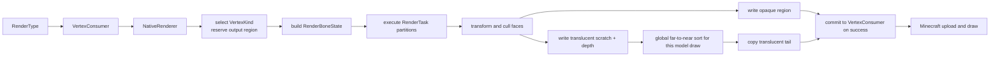

<!-- Modified by LuoMuQAQ for the unofficial Minecraft 26.3 / NeoForge port (2026). -->
# CPU render 与顶点输出

`renderer::Render` 消费有效的 `ModelState`、`RenderParameters`、`VertexKind` 和输出区间，生成 Minecraft 可上传的顶点。`NativeRenderer` 在提交时生成独立顶点快照，宿主稍后通过 `VertexConsumer` 回放；native 负责 `RenderBoneState`、面语义与字节写入。

## 主流程



Java 完成 `entity` 姿态补偿、模型缩放、纹理与 `RenderType` 选择；`NativeRenderer` 再把 draw 矩阵、context、光照、overlay、颜色和 Iris entity data 适配为 `RenderParameters`。模型视图取当前 model-view stack。成功写入的投影 UBO slice 与 CPU 矩阵副本关联；每次 draw 按 `RenderSystem` 当前绑定的 slice 查找，因此缓存复用、pass 切换和投影恢复都使用对应矩阵。关联使用 weak key，不延长 GPU buffer 的生命周期。未知 slice 不沿用上一 pass 的矩阵。纹理像素与 GPU 句柄不传给 native。

当前生产提交强制走 fallback，并在 `nRender` 返回后立刻复制共享 `int[]`。旧 `BufferBuilder` 和 Sodium accessor 已不适用于宿主，Java 已移除这些 Mixin 与 accessor。Native 的 direct 顶点布局保留以维持 ABI，但生产 Java 路径统一使用快照与回放。回放使用不乘姿态的 `addVertex`，因为快照里的 position 已经是模型空间结果；鱼线和原版线段仍用带 pose 的顶点调用。颜色从低字节 R、G、B、A 改写成宿主 `ARGB`。当前绑定的 slice 没有 CPU 投影副本时跳过本次模型提交。

主模型显式消费宿主 `EntityRenderState.outlineColor`：正常几何与轮廓分别提交，轮廓回放共用同一不可变顶点快照，并按宿主颜色写 position/color/UV。不可见发光模型只提交轮廓。`AFFECTS_OUTLINE` 只提供轮廓 RenderType，不让 custom geometry 自动产生第二份节点。

## 变换与面语义

Java 写入 JNI 矩阵块前显式设置 `ByteOrder.nativeOrder()`；model、view、projection 和 normal 都按 native float 布局写入。NIO 的 `duplicate()` 会重置字节序，不能依赖 backing 的原字节序，也不能把格式文件的编码约定用于这块进程内矩阵数据。该约定同时覆盖世界、第一人称和 GUI 预览。

每个可见骨骼先形成一份 `RenderBoneState`：最终 position 变换、normal 变换、投影后面朝向系数、opaque/translucent RGBA、light，以及透明面需要的 depth 变换。Position、normal 与 clip-space 变换必须分别从上层提供的正确矩阵组合，不能从单一 4×4 matrix 猜测全部语义。

颜色、alpha 和 light 均在 `RenderState::Update` 按 bone 一次性合成，顶点循环只选择结果。每个 RGB 通道使用 `round(parent * bone / 255)`；shader 后续叠加方向光、overlay、lightmap 和 fog。Opaque/cutout 保留上层 alpha；只有 baked `translucent` 与 `translucent_culling` 分区将上层 alpha 乘以 bone alpha。Glow `-1` 保留上层 light，`0–15` 同时覆盖 block/sky light；这些属性均不向子骨骼继承。

Face 在 Bake 已保存 normal、plane、winding 和 center。Render 用最终 clip transform 判断其投影后朝向，而不是使用简单的相机方向点积：

- culling 分区丢弃 back face；double-sided 分区保留它，并反转输出 normal；
- 反向 cube 沿用其 baked winding，因此保持只显示背面一类 authoring 语义；
- 透明 depth 使用变换后 face center 的 NDC 深度，与顶点任务使用同一姿态；
- 非有限输入矩阵或骨骼变换使 Render 失败；无效方向归零，非有限透明 depth 使用 invalid sort key。

Normal 使用上层 normal matrix 与骨骼 normal pose 的组合；非均匀缩放等非保角变换在打包前归一化，Vanilla 与 Iris direct 输出均采用该规则，back face 再反转 normal。校验与视觉验收边界见[渲染已知问题](../../status/known-issues/rendering.md)。

PBR tangent 在最终 position / normal 语义下变换；非保角路径单独归一化，镜像、骨骼 determinant 与 back face 共同修正 handedness。无 PBR 时扩展格式写确定的零 tangent，不使用未初始化数据。

## `RenderType`、`renderer::RenderContext` 与 `VertexKind`

一次模型 draw 中的三者是正交维度：`RenderType` 决定 Minecraft draw state 与目标 `VertexConsumer`，`renderer::RenderContext` 是 Java `RenderContext` 的三值投影，`VertexKind` 只选择 native 顶点布局。Iris shadow 因而不是一种 `VertexKind`。

| 输出路径 | 选择条件 | 交接语义 |
|---|---|---|
| 顶点快照 | 所有生产模型提交 | Native 写中间顶点；返回后立即复制共享数组，延迟节点只保留独立数据 |
| `VertexConsumer` 回放 | 宿主执行 `SubmitNodeCollector` 节点 | 写入 position、color、UV、overlay、light、normal；宿主的可选管线适配处理额外格式语义 |

Native 仍保留 Vanilla/Iris direct 布局定义，但当前 Java 工程没有 direct buffer 预留或提交入口。保留布局不能作为这些路径已运行或视觉等价的证据。

Fallback 中间顶点的 packed normal 从低字节起依次保存 X、Y、Z，以 ±127 编码；Java 按 signed byte / 127 解码后交给 `VertexConsumer`。颜色整数从低字节起是 R、G、B、A，回放时改写成宿主 `ARGB` 再调用 `addVertex`。编码与解码约定匹配，完整路径的视觉等价仍需实机验收。

快照只在 native 生成成功后提交；native 失败或没有有效顶点时不加入绘制节点。失败降级缺口见[渲染已知问题](../../status/known-issues/rendering.md)。

## 顶点输出区间与 translucent 排序

最终逻辑布局为：

```text
[cutout][cutout_no_culling][translucent + translucent_culling tail]
```

`cutout` 与 `cutout_no_culling` 的 `RenderTask` 直接写固定区间；`translucent` 与 `translucent_culling` 先写临时区并记录每个 quad 的 face-center depth，全部任务完成后按本次模型 draw 全局远到近排序，再复制到预留尾部。宿主使用反向深度，而 native 排序按 NDC 深度降序；Java 在传入 native 的矩阵副本中只对 clip z 行取反，使其降序仍对应远到近。GPU 投影不改动，clip x/y/w 保持一致，因此面朝向、顶点位置与 normal 不受该深度约定转换影响。剔除留下的未写容量会清零并标记 invalid；depth 非有限的已写 quad 保留并排到末尾。

Iris shadow 不执行透明排序，保持生成顺序。跨 draw 的混合由 Minecraft 上层管线决定，保证范围见[transparency-scope](../../product-decisions/decisions/transparency-scope.md)。Java 外层关闭模型局部 culling 与 upload-time sorting 的重复处理，使 native 的面剔除与单模型透明排序成为唯一来源；主渲染入口在 native translucent vertex count 非零时选择 translucent `RenderType`。

## SIMD 分派

分派改变 lane 数、批量计算和指令选择；与 Bake/cache 共用的能力选择及布局见[AoSoA](bake-and-partition.md#aosoa-与能力相关布局)，输出语义保证见[geometry-regions](../../product-decisions/decisions/geometry-regions.md#bcoutput-paths-are-visually-equivalent)。
